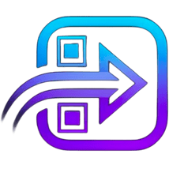

<div align="center">
  
  <h1>Tap2Enter</h1>
  <p><b>Replace paper event forms with a single QR scan.</b><br/>A Next.js landing site with a PHP lead-capture API for giveaways, contests and lead capture at real-world events.</p>
  <p>
    <a href="LICENSE"></a>
    
    
    
    
    
  </p>
</div>

---

Landing site for **Tap2Enter** — a concept that replaces paper forms at real-world events with
a single QR scan. Scan once, enter once, done. Aimed at giveaways, contests, and lead capture
at events.

## Features

- Conversion-oriented one-page site built from modular sections (hero, problem, workflow,
  solution, before/after, audience sections, CTA, trust, footer).
- MDX-style blog under `app/blog/`.
- Lead-capture flow: a modal collects an email, backed by a small **PHP API** for shared hosting.
- Click and scroll-depth analytics (Vercel Analytics + custom tracking helpers).

## Architecture

- **Frontend** — Next.js (App Router) + React + TypeScript + Tailwind CSS, deployable to Vercel.
- **Backend** — `api/` holds two standalone PHP endpoints for PHP shared hosting:
  - `POST /api/track-click.php` — records a CTA click, returns a `lead_id`.
  - `POST /api/submit-email.php` — attaches an email to a tracked click.
  - CORS-restricted, per-IP-hash rate limited, with a honeypot and salted (never raw) IP storage.
  - MySQL/MariaDB schema in `migrations/`. See `api/README.md` for deployment details.

## Tech

- **Next.js 16** (App Router) + **React 19** + **TypeScript**
- **Tailwind CSS 4**, Framer Motion, lucide-react
- **PHP** lead-capture API + **MySQL/MariaDB**

## Run

```bash
npm install
npm run dev   # http://localhost:3000
```

The PHP API is deployed separately to shared hosting; copy `api/.env.example` to `api/.env` and
fill in the database credentials, `IP_HASH_SALT`, and `ALLOWED_ORIGINS` (details in `api/README.md`).

## License

Released under the [MIT License](LICENSE) © 2026 Olivier Lüthy. You're free to use, modify and distribute this
software, including commercially, as long as the copyright notice and license are included.

## Author

Built by **Olivier Lüthy** — [GitHub](https://github.com/olivierluethy).
